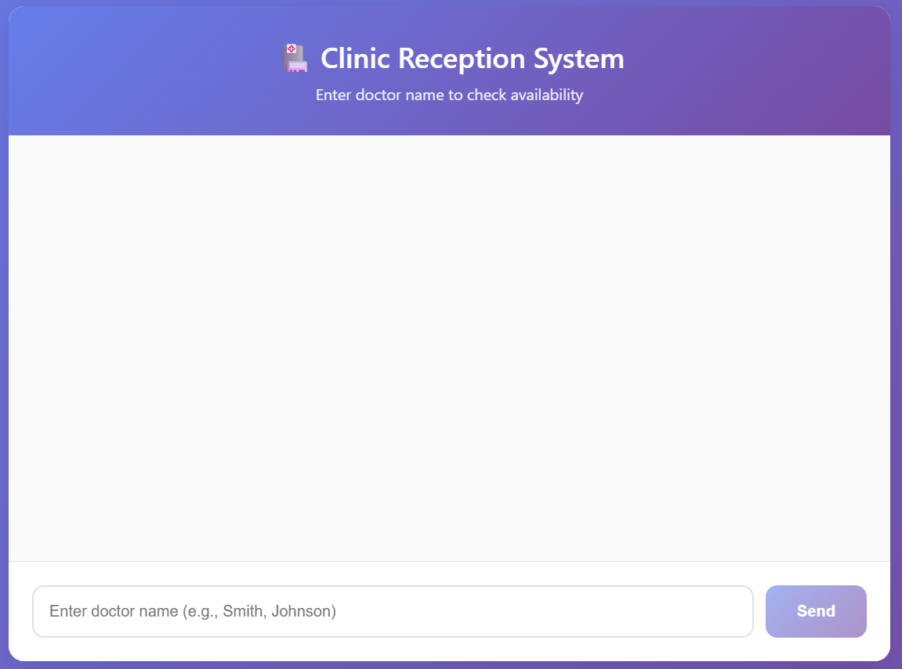
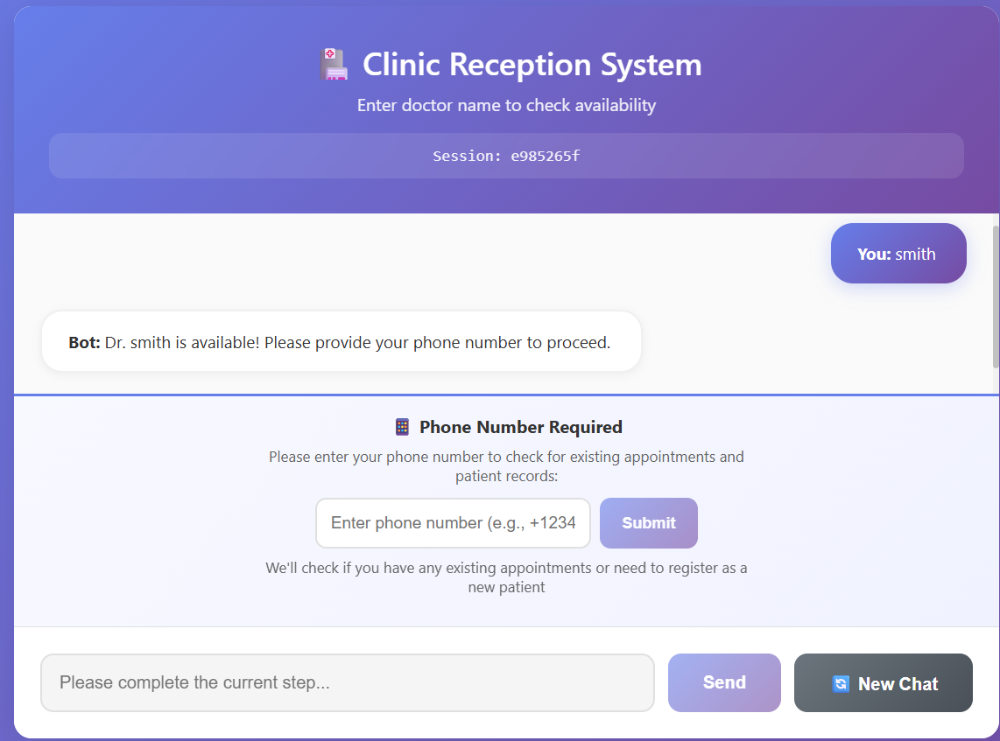
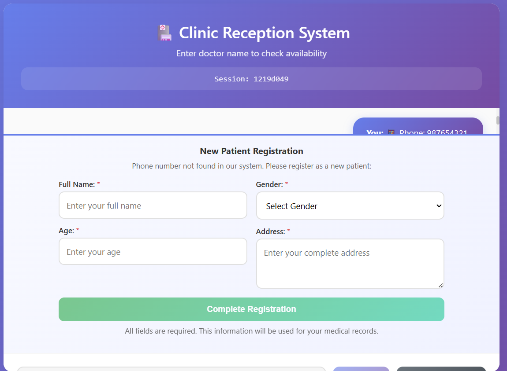
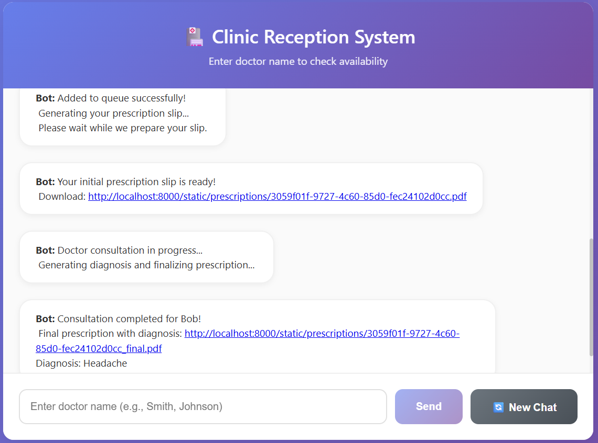
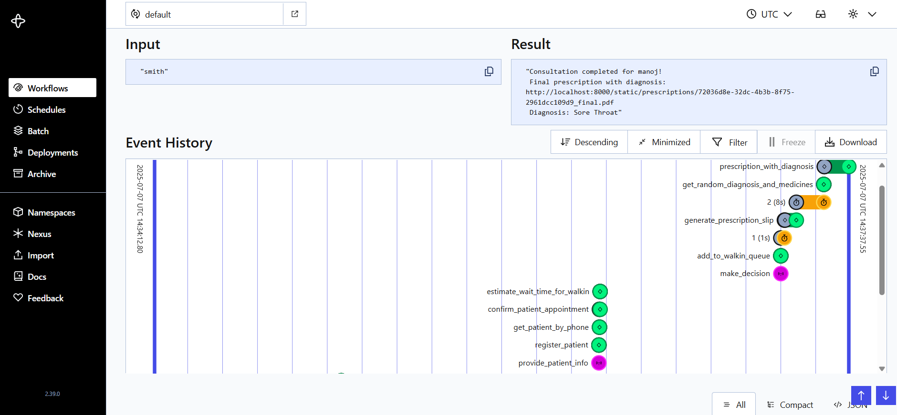

# 🏥 Clinic Reception System

A comprehensive clinic reception workflow system built with **Temporal**, **FastAPI**, and **React** that simulates real-world healthcare scenarios including doctor availability checks, patient registration, queue management, and prescription generation.

## Table of Contents
- [Features](#features)
- [Architecture](#architecture)
- [Prerequisites](#prerequisites)
- [Installation](#installation)
- [Usage](#usage)
- [API Documentation](#api-documentation)
- [Workflow Overview](#workflow-overview)
- [Testing](#testing)

## Features

- **Doctor Availability Check**: Real-time verification of doctor availability
- **Patient Management**: Registration and identification system
- **Smart Queue System**: Walk-in queue vs. scheduled appointments
- **Prescription Generation**: Automated prescription creation with diagnosis
- **Conversational Interface**: React-based chat UI for seamless user experience
- **Temporal Workflows**: Reliable workflow orchestration for business logic


## Architecture

```
┌─────────────────┐    ┌─────────────────┐    ┌─────────────────┐
│   React UI      │    │   FastAPI       │    │   Temporal      │
│   (Frontend)    │◄──►│   (Backend)     │◄──►│   (Workflows)   │
│   Port: 5173    │    │   Port: 8000    │    │   Port: 8080    │
└─────────────────┘    └─────────────────┘    └─────────────────┘
```

## Prerequisites

Before you begin, ensure you have the following installed:

- **Python** 3.10 or higher
- **Node.js** 20 or higher
- **Docker Desktop** (for Temporal server)

## Installation

### 1. Clone the Repository

```bash
git clone <repository_url>
cd clinic_reception
```

### 2. Database Initialization
#### Run Database Setup

```bash
python setup_database.py
```

> **Note**: This will create a `clinic.db` SQLite database file with all the necessary tables and data.

### 3. Backend Setup (FastAPI + Temporal)

#### Create Virtual Environment

<details>
<summary><strong>Using Conda</strong></summary>

```bash
conda create --name clinic-env python=3.10
conda activate clinic-env
```
</details>

<details>
<summary><strong>Using venv</strong></summary>

```bash
# On macOS and Linux
python3 -m venv env
source env/bin/activate

# On Windows
python -m venv env
.\env\Scripts\activate
```
</details>

#### Install Python Dependencies

```bash
pip install -r requirements.txt
```

#### Start Temporal Server

```bash
docker compose up -d
```

> **Note**: Temporal Web UI will be available at [http://localhost:8080](http://localhost:8080)

#### Start Temporal Worker

```bash
cd backend
python run_worker.py
```

#### Start FastAPI Server

```bash
cd backend
uvicorn api_server:app --reload
```

> **Note**: Backend API will be available at [http://localhost:8000/docs](http://localhost:8000/docs)


### 4. Frontend Setup (React)

#### Navigate to Frontend Directory

```bash
cd frontend
```

#### Install Dependencies

```bash
npm install
npm install axios
```

#### Start Development Server

```bash
npm run dev
```

> **Note**: Frontend will be available at [http://localhost:5173](http://localhost:5173)


## Usage

1. Open your browser and navigate to [http://localhost:5173](http://localhost:5173)
2. Enter a doctor's name to check availability
3. Follow the conversational prompts to:
   - Provide your phone number
   - Register (if new patient) or proceed (if existing)
   - Choose between waiting in queue or booking an appointment
4. Receive your prescription upon completion

### Screenshots

#### Frontend Chat Interface

*Main chat interface where users interact with the clinic reception system*

#### Doctor Availability Check

*Checking doctor availability - shows response for available/unavailable doctors*

#### Patient Registration Form

*New patient registration form with required fields*

#### Queue Management

*Options for waiting in queue vs booking appointment*

#### Prescription Generation

*Final prescription generated after consultation*

#### Temporal Workflow Dashboard

*Temporal Web UI showing workflow execution and monitoring*


## API Documentation

### Base URL: `http://localhost:8000/docs`

| Method | Endpoint | Description | Request Body |
|--------|----------|-------------|--------------|
| POST   | `/chat` | Start reception workflow | `{"message": "doctor_name"}` |
| POST   | `/phone` | Submit phone number | `{"phone": "1234567890", "workflow_id": "..."}` |
| POST   | `/register` | Register new patient | `{"name": "...", "age": 30, "gender": "...", "address": "...", "workflow_id": "..."}` |
| POST   | `/decision` | Choose wait vs. book | `{"decision": "book_later" or "continue", "workflow_id": "..."}` |
| GET    | `/check_prescription/{workflow_id}` | Check workflow status | N/A |


## Workflow Overview

### Detailed Workflow Steps

#### Step 1: Doctor Availability Check
- User enters doctor's name
- System validates availability
- If unavailable: workflow terminates with message
- If available: proceed to patient intake

#### Step 2: Patient Identification
- User provides phone number
- System checks patient database
- Determines if patient is new or existing

#### Step 3: Patient Processing
**For Existing Patients:**
- Check for today's appointments
- If appointment exists: skip queue
- If no appointment: show wait time options

**For New Patients:**
- Display registration form
- Collect: name, age, gender, address
- Register in system
- Show wait time options

#### Step 4: Service Delivery
**Wait in Queue:**
- Add to walk-in queue
- Generate initial prescription slip
- Simulate consultation
- Add diagnosis and medicines
- Generate final prescription PDF

**Book Appointment:**
- Schedule 15-minute slot
- Show confirmation message

## Testing

### Manual Testing
1. Access the chat interface at [http://localhost:5173](http://localhost:5173)
2. Test different scenarios:
   - Available vs. unavailable doctors
   - New vs. existing patients
   - Patients with vs. without appointments
   - Wait-in-queue vs. book-later decisions


### Workflow Monitoring
- View real-time workflow progress at [http://localhost:8080](http://localhost:8080)
- Monitor workflow execution, task queues, and worker status


## Project Structure

```
clinic_reception/
├── backend/
│   ├── api_server.py              
│   ├── run_worker.py       
│   ├── workflows.py          
│   └── activities.py         
├── frontend/
│   ├── src/
│   │   ├── App.jsx         
│   │   ├── ChatMessage.jsx 
|   |   ├── config.js
│   │   ├── index.css
|   |   └── main.jsx
│   ├── public/
|   |   └── vite.svg
│   ├── .gitignore
│   ├── eslint.config.js
│   ├── index.html
│   ├── package-lock.json
│   ├── package.json 
|   └── vite.config.js
├── data/                   # CSV data files
│   ├── doctor_schedule.csv
│   ├── patients.csv
│   ├── appointments.csv
│   ├── doctor_queue.csv
│   └── diagnosis_medicines.csv
├── prescription/ 
│   └── prescription_template.docx          
├── docker-compose.yml      
├── requirements.txt        
├── setup_database.py       
├── clinic.db              # SQLite database (created after setup)
└── README.md
```